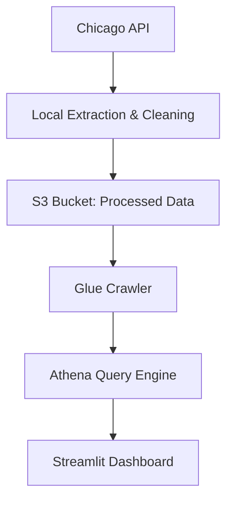

# 🚖 Chicago Rideshare ETL & Interactive Dashboard


[](https://chicago-rideshare-dashboard.streamlit.app/)

> 📍 [Live Dashboard](https://chicago-rideshare-dashboard.streamlit.app/)

---

## 🛠️ Project Overview

This project demonstrates a complete ETL pipeline and interactive dashboard for analyzing Chicago's rideshare (TNP) data using Python, AWS, SQL, and Streamlit. 

It includes:
- **Data extraction** from Chicago Open Data API
- **Transformation** using pandas
- **Cloud storage** with AWS S3
- **Metadata cataloging** using AWS Glue
- **SQL querying** via Athena
- **Interactive dashboard** with Streamlit + Plotly

---

## 📐 Architecture Overview

Here's a simplified architecture of the pipeline:



- The raw TNP trip data is pulled from the public API.
- After local cleaning and preprocessing, the data is uploaded to AWS S3.
- AWS Glue crawls the data and makes it queryable through Athena.
- Streamlit visualizes the final query results as interactive dashboards.

---

## 📊 Visual Insights

The dashboard includes:
- 💰 Total tips received by day of the week
- 💳 Average trip cost trend by weekday
- 🚘 Average trip distance & duration per day
- 📍 Top pickup and dropoff locations (Map)
- 🧾 Fare structure: fare vs tip vs extra charges

---

## 🚀 Tech Stack

- **Languages**: Python, SQL
- **Libraries**: pandas, plotly, streamlit, requests, boto3
- **AWS Services**: S3, Glue, Athena
- **Deployment**: Streamlit Cloud

---

## 📁 Project Structure

```
chicago-rideshare-etl/
├── data/athena-query-results                     # Raw and processed CSVs (gitignored)
├── streamlit_app.py          # Streamlit dashboard
├── requirements.txt          # App dependencies
└── README.md                 # Project overview
```

---

## 💾 Setup & Run Locally

```bash
pip install -r requirements.txt
streamlit run streamlit_app.py
```

---

## 📚 Data Source

[Chicago TNP Trips Dataset](https://data.cityofchicago.org/Transportation/Trips-from-Public-Chauffeurs/m6dm-c72p)

---

## ✨ Author

**Raghav Gali**  
🔗 [LinkedIn](https://www.linkedin.com/in/raghavgali)
